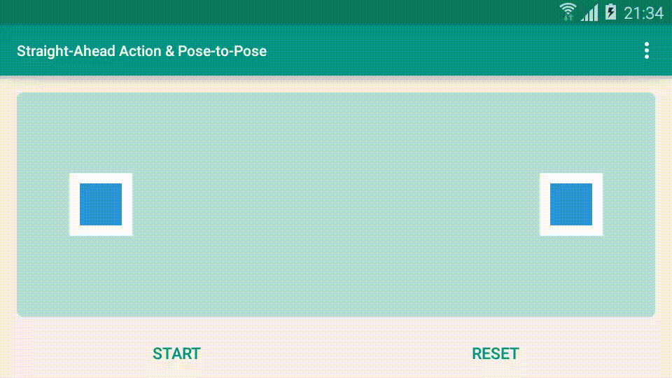

Animation Principles for the Android.

---

Inspired by [here](https://cssanimation.rocks/principles/);

### Squash and stretch

### Anticipation

### Staging

### Straight-Ahead Action and Pose-to-Pose
