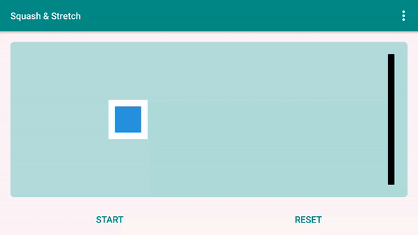
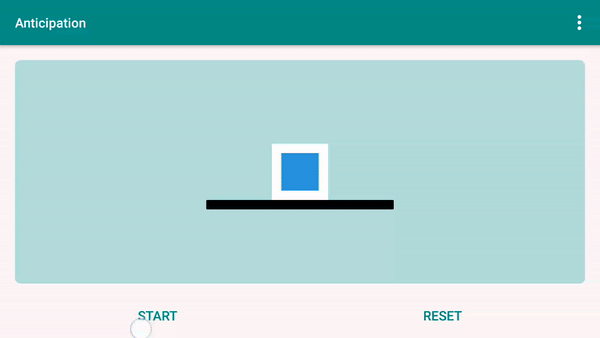
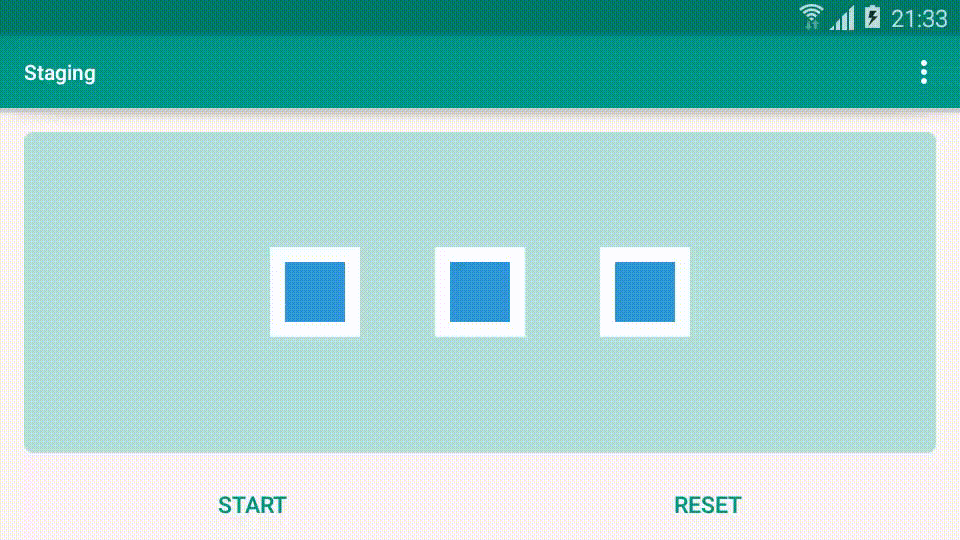
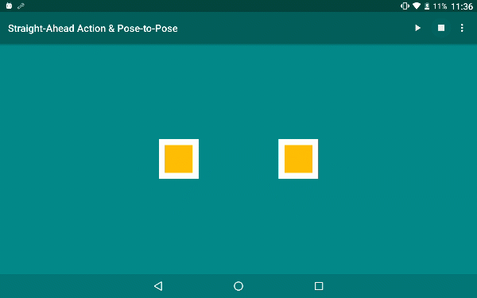
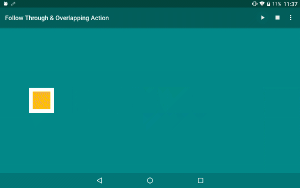
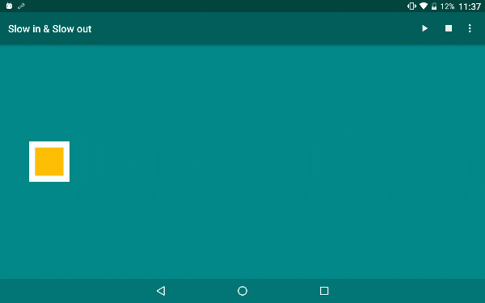
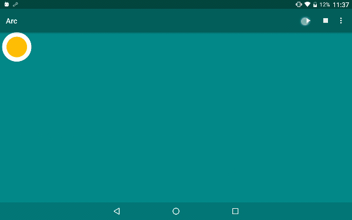
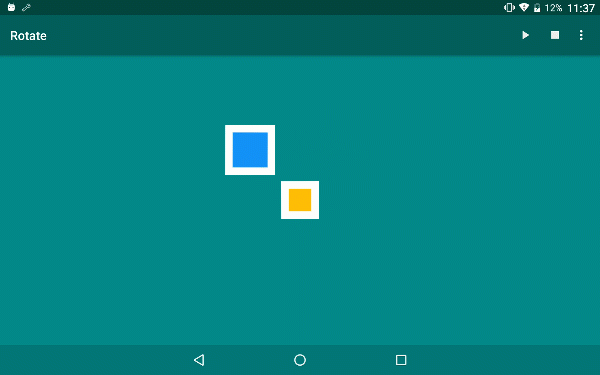
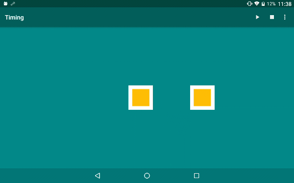

# Disney's Twelve Basic Principles of Animation on Android

This project demonstrates [12 basic principles of animation](https://en.wikipedia.org/wiki/12_basic_principles_of_animation)  on Android platform. 
Inspired by https://cssanimation.rocks/principles/

All animations in this project are written & implemented with [Android Property Animation](https://developer.android.com/guide/topics/graphics/prop-animation.html)
 APIs.

## Squash and stretch

## Anticipation

## Staging

## Straight Ahead Action and Pose to Pose

## Follow Through and Overlapping Action

## Ease In and Ease Out

## Arc

## Timing

