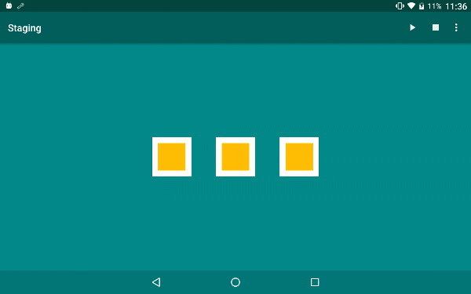

This project demonstrates [12 basic principles of animation](https://en.wikipedia.org/wiki/12_basic_principles_of_animation)  on Android platform, all animation code are written with [Android Property Animation](https://developer.android.com/guide/topics/graphics/prop-animation.html)
 APIs.

Inspired by https://cssanimation.rocks/principles/

---

### Squash and stretch

---

### Anticipation

---

### Staging

---

### Straight Ahead Action and Pose to Pose

---

### Follow Through and Overlapping Action

---

### Ease In and Ease Out

---

### Arc

---

### Timing

